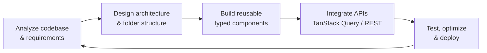

<div align="center">


<a href="https://rezumi2.vercel.app/">
  
</a>

<p>
  <a href="https://rezumi2.vercel.app/"></a>
  <a href="https://www.linkedin.com/in/tohirbek-sadriddinov-dev/"></a>
  <a href="https://t.me/tohir_sadriddinov"></a>
  <a href="mailto:toxir4626@gmail.com"></a>
  <a href="https://www.instagram.com/tohirbek_sadriddinov/"></a>
</p>


</div>

---

## 👨‍💻 About me

```ts
const tohir = {
  role:        "Frontend Engineer (React / Next.js) · growing into Full-Stack",
  location:    "Tashkent, Uzbekistan 🇺🇿",
  experience:  "1+ year of commercial experience on real products",
  focus:       ["Scalable architecture", "Reusable UI systems", "Performance", "DX"],
  currently:   ["Node.js + PostgreSQL backends", "SaaS development", "React Native"],
  education:   ["IT Park", "Najot Ta'lim"],
  aiWorkflow:  "I drive Claude / Codex / Copilot with my own file structure & structured prompts — AI accelerates, I architect.",
  openTo:      "Frontend / Full-Stack roles, freelance & product collaborations",
};
```

- 🏗️ **Architecture first.** On existing codebases I start by auditing structure, patterns and long‑term maintainability; on new projects I own everything from architecture to delivery.
- ♻️ **Minimal tech debt.** Clean folder structure, reusable components, typed APIs and predictable state.
- 🤝 **Team player.** Close collaboration with backend engineers, designers and PMs — including a role‑based education platform for a Japanese company.
- ⚡ **Production mindset.** Code‑splitting, caching with TanStack Query, validation, security headers, Docker and CI‑friendly setups.

---

## 🛠️ Tech stack

<div align="center">

**Frontend**


**Backend & Data**


**Tools & Platforms**


</div>

| Area | Technologies |
|---|---|
| **Core** | HTML5, CSS3 / BEM, Tailwind CSS, JavaScript (ES2023), TypeScript |
| **Frameworks & State** | React, Next.js, React Native, Redux Toolkit, Zustand, TanStack Query |
| **UI Libraries** | shadcn/ui, Ant Design, Material UI |
| **Backend** | Node.js, Express.js, PostgreSQL, Prisma ORM, Redis, Zod, Swagger / OpenAPI |
| **Security** | JWT + refresh‑token rotation, Argon2, Helmet, CORS, rate limiting |
| **DevOps** | Docker / Docker Compose, Git & GitHub, Vercel, Netlify |
| **AI tooling** | Claude, Codex, GitHub Copilot |

---

## 🚀 Featured projects

### 🏢 Commercial & team products

| Project | Description | Stack |
|---|---|---|
| **[UzFixCar](https://www.uzfixcar.com/)** | Roadside‑assistance platform for Uzbekistan: car services, mechanics, tow trucks and 24/7 SOS in one place. Google sign‑in, multilingual UI, service & tow catalogs, request flow. Fast SPA split into vendor chunks. | React · Vite · TanStack Query · Tailwind |
| **TTG — Education Platform** | LMS for a **Japanese company** with 4 roles: System Admin, Admin, Teacher, Student. Role‑based access, dashboards and course management. | React · TanStack Query · Tailwind · shadcn/ui |
| **[Sun Energy Admin](https://quyosh-panellari-admin.netlify.app/)** · [repo](https://github.com/MaxmudAxmedov/admin-sun-energy) | Admin panel for a solar‑panel company. Reusable frontend architecture and close backend collaboration improved performance and UX. | React · Next.js · TanStack Query · Tailwind |
| **[IT Park](https://www.it-park.uz/)** | Worked in a team on real products, growing frontend skills and delivering useful digital services. | Frontend · Teamwork |

### 🤖 Backend / Full‑stack

| Project | Description | Stack |
|---|---|---|
| **Enterprise REST API** | Production‑grade REST API: JWT + Argon2, SHA‑256 refresh‑token rotation, Redis sessions, Helmet, CORS allow‑list, rate limiting, full Zod DTO validation, Pino logging, Swagger docs, Docker Compose — **all tests passing ✅** | Node.js · Express · TypeScript · PostgreSQL · Prisma · Redis · Docker |
| **React Native App** | Cross‑platform iOS/Android app with reusable components, navigation and REST API integration. | React Native · TypeScript |

### 🎨 Landing pages & websites

| Project | Description | Stack |
|---|---|---|
| **[KARVON](https://karvon-eta.vercel.app/)** | Premium travel‑agency site: preloader, custom cursor, parallax, tour filters, gallery, blog, booking form. | HTML · CSS · JS |
| **[Uy Makon](https://uy-makon.vercel.app/)** | Real‑estate agency: 4,500+ listings catalog, category filters, slider, animated counters, consultation form. | HTML · CSS · JS |
| **[TOMSERVIS](https://tom-service.vercel.app/)** | Metal roofing service: catalogs, **roof cost calculator**, project gallery, validated lead form — zero‑framework, blazing fast. | HTML · CSS (BEM) · JS |
| **[Gitpod Landing](https://gitpod-lemon.vercel.app/)** | Cloud IDE marketing page: tabbed live‑code demo, dark/light theme, monthly/yearly pricing toggle, FAQ accordion, scroll progress. | HTML · CSS · JS |
| **[Radiator Pro](https://radiator-pro.vercel.app/)** | Service advertising site with services, contacts and coverage area. | HTML · CSS · JS |

> 📂 More work: [FlexiMarket](https://github.com/sadriddinovtohir/FlexiMarket) · [giperMart](https://github.com/sadriddinovtohir/giperMart) · [Sanoat‑portali](https://github.com/sadriddinovtohir/Sanoat-portali) · [Agriculture](https://github.com/sadriddinovtohir/Agriculture) · [Team‑melon](https://github.com/sadriddinovtohir/Team-melon) · all deployments on [Vercel](https://vercel.com/sadriddinovtohirs-projects)

---

## 📊 GitHub stats

<div align="center">


</div>

---

## 🧭 How I work



---

<div align="center">

### 🤝 Let's build something great together

📧 **toxir4626@gmail.com** · 📱 **+998 90 128 33 07** · 🌐 **[rezumi2.vercel.app](https://rezumi2.vercel.app/)**


</div>
